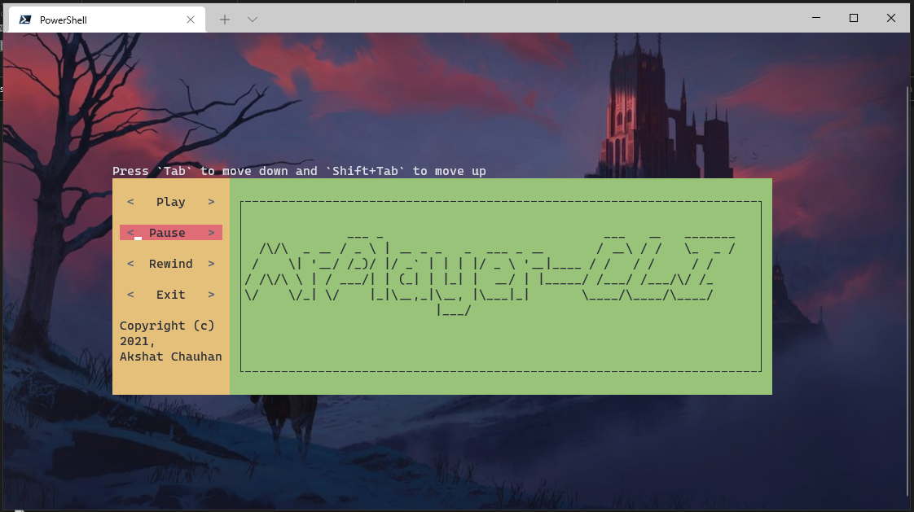

# The beautiful CLI of MrPlayer



Suggested using windows terminal becuse it suports
many languages when extracting lyrics.

Terminal theme 'is One Half Dark'

---

## Playing Song

For playing song go to directory where the song is and type this command -

```powershell
mpc -ps "<song name.mp3>"
```

---

## Lyrics
MrPlayer-CLI gets lyrics by extracting it from Genius.com

You need to have a genius api key and in order to get it

you should have an account in Genius.com.

Just paste your api key in 'C:/Users/your username/.MrPLayer/api_ket.txt'

1. For getting lyrics type this command -

```powershell
mpc -gl "<song name>"
```
2. For singer specific song lyrics type this command -

```powershell
mpc -gl "<song name>" -si "<singer name>
```

For knowing the source code of MrPlayer-CLI type this command -

```powershell
mpc -sc